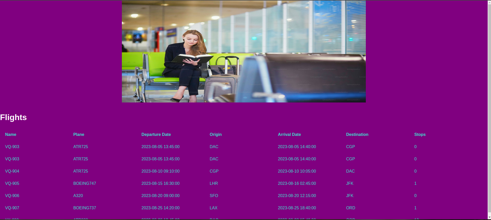

# Image gallery

> Simple list of flights

## Table of contents

- [Image gallery](#image-gallery)
  - [Table of contents](#table-of-contents)
  - [General info](#general-info)
  - [Screenshots](#screenshots)
  - [Technologies](#technologies)
  - [Setup](#setup)
  - [Code Examples](#code-examples)
  - [Features](#features)
  - [Status](#status)

## General info

> The objective of the project is to practice separation of concern in
> JavaScript.

## Screenshots



## Technologies

- JavaScript
- HTML5
- CSS3
- VSC code
- Jest

## Setup

clone the repo and start using the stop watch.

## Code Examples

```js
const data = {
	flights: [
		{
			id: 1,
			name: 'VQ-903',
			plane: 'ATR725',
			departureDate: '2023-08-05 13:45:00',
			origin: 'DAC',
			arrivalDate: '2023-08-05 14:40:00',
			destination: 'CGP',
			stops: 0,
		},
	],
};
```

## Features

List of features ready and Todos for future development

- Flight Listing: Display a list of available flights, including essential
  details such as departure and arrival airports, departure and arrival times,
  airlines, flight numbers, and prices.

- Sorting Functionality: Provide the ability to sort the list of flights based
  on different parameters such as price, departure time, arrival time, or
  duration.

- Flight Details: Offer users the option to view more detailed information about
  each flight

## Status

Project is: completed
